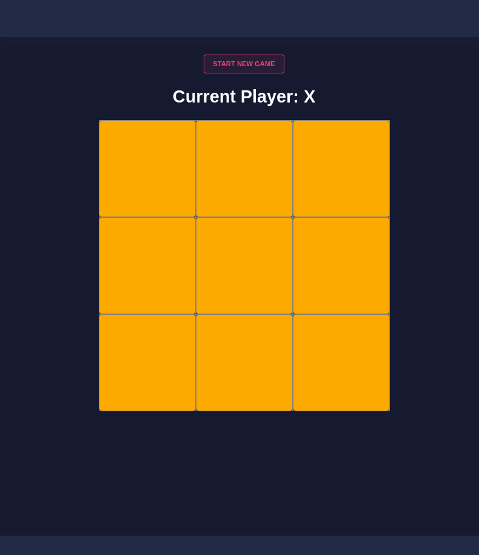
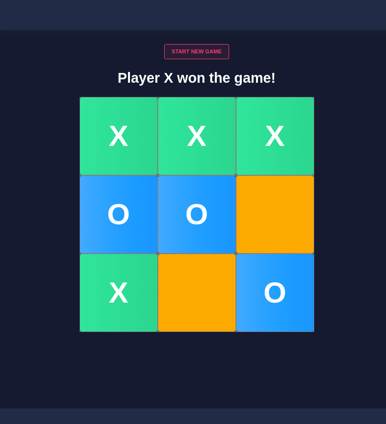

# Tic Tac Toe Angular 🎮


## 🕹️ Sobre o game

Game **`Tic Tac Toe`** foi desenvolvido utilizando Angular e design do Nebular.

---

## 🧭 Rodando o Game

  ```bash
  # Clone este repositório
  $ git clone https://github.com/vitorsemidio-dev/tic-tac-toe-angular.git

  # Mude para a pasta do projeto
  $ cd tic-tac-toe-angular

  # Rode o projeto
  $ ng server -o

  # O projeto irá abrir em http://localhost:4200
  ```
---

## 🎲 Antes da partida



---

## 🏆 Vencedor



---

## 📚 Referências

- [Video](https://www.youtube.com/watch?v=G0bBLvWXBvc) 📹
- [Nebular](https://github.com/akveo/nebular) 🔖


## 📝 Licença

Acesse [MIT](https://github.com/vitorsemidio-dev/tic-tac-toe-angular/blob/master/LICENSE) para mais informações.
